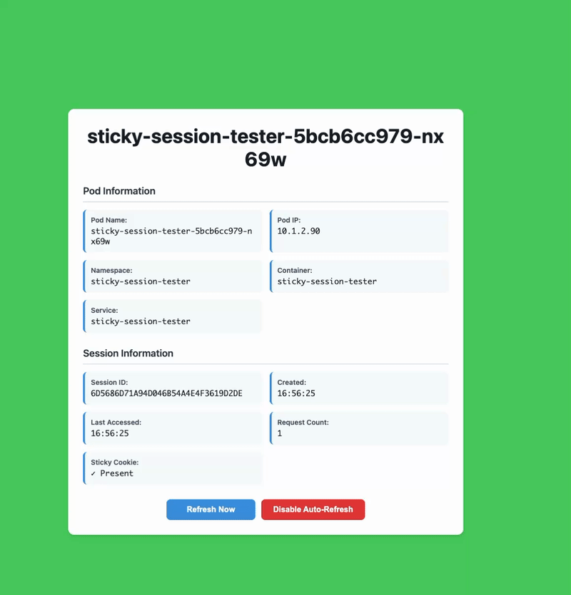
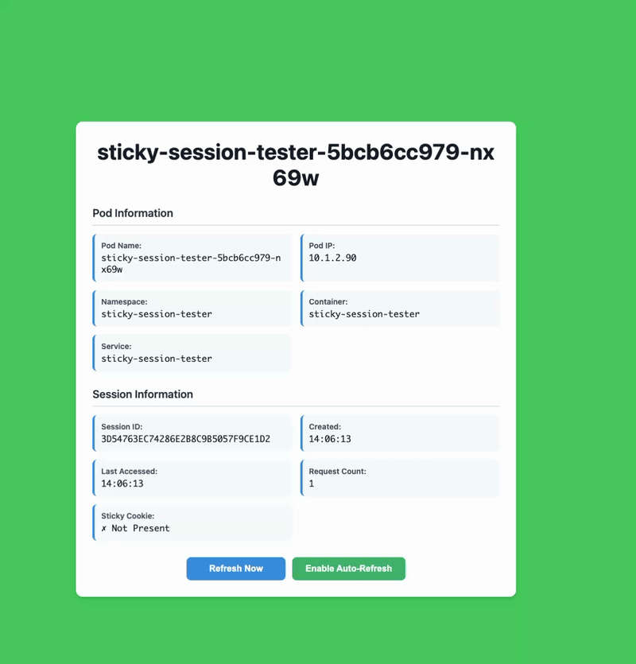
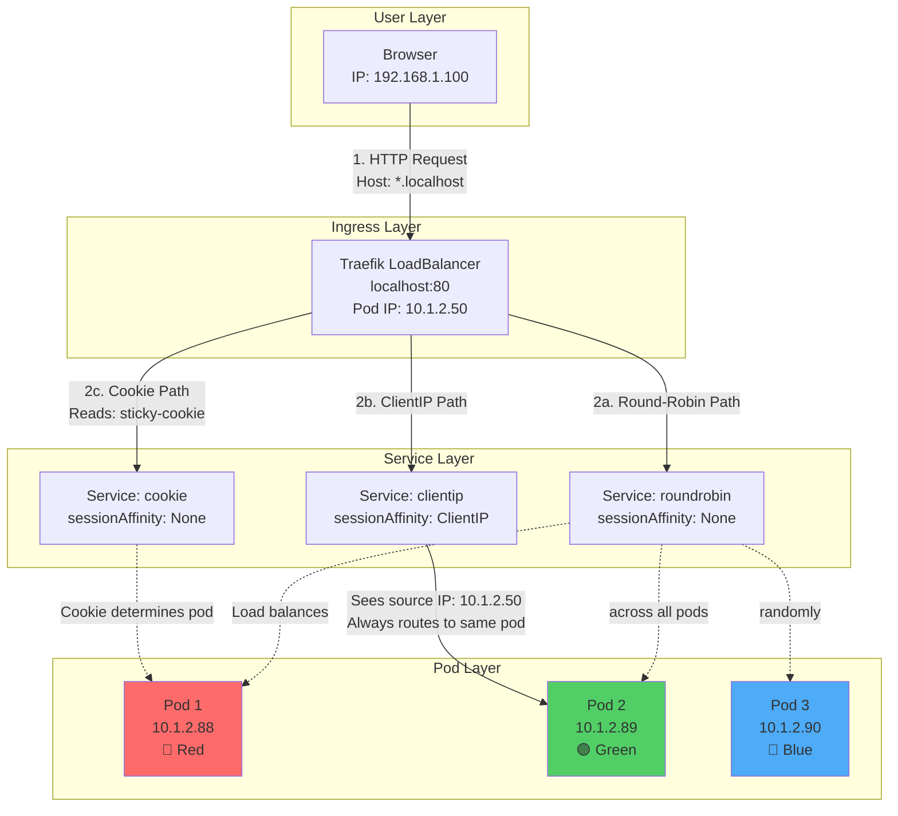
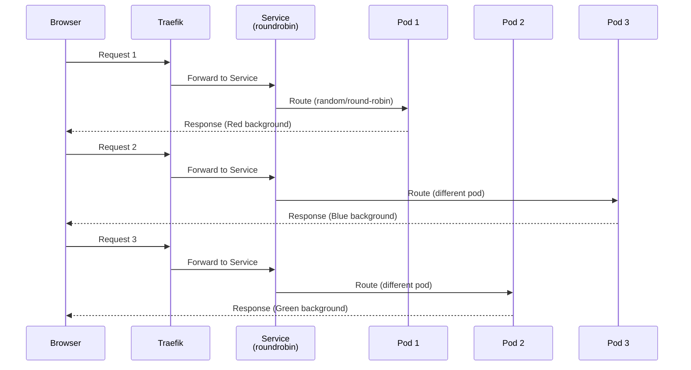
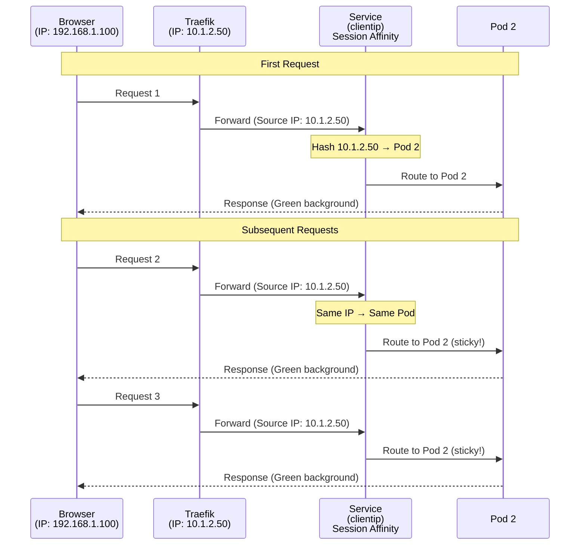
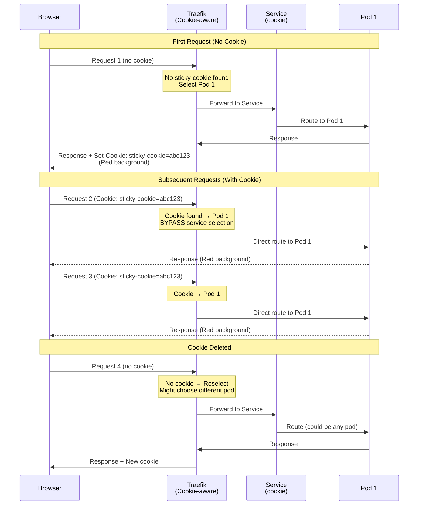

# Sticky Session Tester

A Spring Boot application designed to test and demonstrate **three levels of session affinity** in Kubernetes with Traefik:

1. **Round-Robin (No Affinity)** - Pure load balancing across pods
2. **ClientIP Affinity** - Kubernetes service-level session persistence based on source IP
3. **Cookie Affinity** - Traefik application-level sticky sessions using HTTP cookies

## Visual Demonstrations

### Cookie Affinity (Sticky Sessions) ✅

Watch how requests **stick to the same pod** when the sticky cookie is present:



**What you see:**
- 🔴 Background stays the same color (sticky to one pod)
- ✓ "Sticky Cookie: Present" indicator
- 📈 Request count incrementing (session persists)
- 🎯 Same Pod Name on every refresh

---

### Round-Robin Load Balancing 🔄

Watch how requests are **distributed across different pods** without session affinity:



**What you see:**
- 🌈 Background color changes (red → green → blue)
- ✗ "Sticky Cookie: Not Present" indicator
- 🔄 Session ID changing between requests
- 🎲 Different Pod Names on each refresh

---

## Features

- **Visual Pod Identification**: Each pod displays a distinct background color (red/green/blue)
- **Session Tracking**: Real-time session ID, creation time, and request counter
- **Cookie Detection**: Shows whether Traefik sticky cookie is present
- **Auto-Refresh**: Optional 2-second auto-refresh to observe load balancing behavior
- **Health Probes**: Spring Boot Actuator with liveness/readiness endpoints
- **Prometheus Metrics**: Built-in metrics exposure for monitoring

## Prerequisites

- Docker Desktop with Kubernetes enabled
- Traefik deployed in the cluster (see main [traefik/README.md](../traefik/README.md))
- kubectl configured for docker-desktop context
- Java 17+ (for local development)
- jq (for testing scripts)

## Quick Start

### 1. Build and Deploy

```sh
# Build the application and Docker image
make build

# Deploy to Kubernetes and configure hosts
make deploy hosts

# Check deployment status
make status
```

### 2. Access the Application

Open your browser to test the three scenarios:

- **Round-Robin**: http://roundrobin.localhost/app/
- **ClientIP Affinity**: http://clientip.localhost/app/
- **Cookie Affinity**: http://cookie.localhost/app/

### 3. Observe the Behavior

- **Round-Robin**: Background color changes on each refresh (different pods)
- **ClientIP**: Same background color on every refresh (same pod)
- **Cookie**: Same background color with cookie present, may change when cookie deleted

## Testing Scenarios

### Test 1: Round-Robin Load Balancing

```sh
# Visit http://roundrobin.localhost/app/
# Refresh multiple times - background should cycle through red/green/blue
```

**Expected**: Different pod (and color) on most refreshes.

### Test 2: ClientIP Session Affinity

```sh
# Visit http://clientip.localhost/app/
# Refresh multiple times - background should stay the same color
```

**Expected**: Same pod (and color) for all requests from your IP.

### Test 3: Cookie-Based Sticky Sessions

```sh
# Visit http://cookie.localhost/app/
# Note the background color and check DevTools for 'sticky-cookie'
# Refresh multiple times - background should stay the same
# Delete 'sticky-cookie' from DevTools
# Refresh - may get a different pod/color
```

**Expected**: Sticky to same pod while cookie exists, new assignment after cookie deletion.

### Automated Testing

```sh
# Run all three test scenarios via curl
make test

# Example output:
# Testing Round-Robin...
# sticky-session-tester-6f8b9d-abc
# sticky-session-tester-6f8b9d-def
# sticky-session-tester-6f8b9d-ghi
# sticky-session-tester-6f8b9d-abc
# sticky-session-tester-6f8b9d-def
```

## Architecture

### Application Components

- **Spring Boot 3.2**: Web framework
- **Spring Boot Actuator**: Health checks and metrics
- **Micrometer Prometheus**: Metrics exporter
- **HTML/CSS/JavaScript**: Single-page frontend with pod color coding

### Kubernetes Resources

- **Namespace**: `sticky-session-tester`
- **Deployment**: 3 replicas with resource limits and health probes
- **Services**:
  - `sticky-tester-roundrobin` - sessionAffinity: None
  - `sticky-tester-clientip` - sessionAffinity: ClientIP (1 hour timeout)
  - `sticky-tester-cookie` - sessionAffinity: None (Traefik handles it)
- **Traefik Middleware**: Path rewriting from `/app` to `/sticky-app`
- **IngressRoutes**: Three Traefik IngressRoutes (one per scenario)
  - `sticky-tester-roundrobin` - Round-robin load balancing
  - `sticky-tester-clientip` - ClientIP session affinity
  - `sticky-tester-cookie` - Cookie-based sticky sessions

### Path Rewriting

The application runs with context path `/sticky-app`, but is accessible via `/app`:

- External: `http://roundrobin.localhost/app/`
- Middleware rewrites: `/app` → `/sticky-app`
- Internal: Spring Boot serves from `/sticky-app/`

This tests Traefik's path manipulation capabilities.

## API Endpoints

All endpoints are under the `/sticky-app` context path:

```
GET  /sticky-app/                          - Landing page (HTML)
GET  /sticky-app/api/info                  - Pod and session info (JSON)
GET  /sticky-app/api/session               - Session details (JSON)
POST /sticky-app/api/session/reset         - Clear session
GET  /sticky-app/actuator/health           - Health check
GET  /sticky-app/actuator/health/liveness  - Liveness probe
GET  /sticky-app/actuator/health/readiness - Readiness probe
GET  /sticky-app/actuator/prometheus       - Prometheus metrics
```

## Makefile Targets

```sh
make help          # Show available targets
make build         # Build app and Docker image
make deploy        # Deploy to Kubernetes
make hosts         # Add /etc/hosts entries
make test          # Run automated tests
make status        # Check deployment status
make logs          # Tail pod logs
make clean         # Delete all resources
make all           # Build, deploy, hosts, and test
```

## Local Development

### Run Locally

```sh
# Build
./mvnw clean package

# Run
./mvnw spring-boot:run

# Access
open http://localhost:8080/sticky-app/
```

### Build Docker Image

```sh
docker build -t sticky-session-tester:latest .
```

### Test Container Locally

```sh
docker run -p 8080:8080 \
  -e POD_NAME=local-pod \
  -e POD_IP=127.0.0.1 \
  -e POD_NAMESPACE=default \
  -e CONTAINER_NAME=sticky-session-tester \
  -e SERVICE_NAME=local-service \
  sticky-session-tester:latest
```

## Troubleshooting

### Pods Not Starting

```sh
# Check pod status
kubectl get pods -n sticky-session-tester

# View pod logs
kubectl logs -n sticky-session-tester -l app=sticky-session-tester --tail=100

# Describe pod for events
kubectl describe pod -n sticky-session-tester -l app=sticky-session-tester
```

### Routes Not Working

```sh
# Check HTTPRoute status
kubectl get httproute -n sticky-session-tester
kubectl describe httproute sticky-tester-roundrobin -n sticky-session-tester

# Check IngressRoute
kubectl get ingressroute -n sticky-session-tester
kubectl describe ingressroute sticky-tester-cookie -n sticky-session-tester

# Check Traefik logs
kubectl logs -n traefik -l app.kubernetes.io/name=traefik --tail=100
```

### Middleware Not Applied

```sh
# Check middleware exists
kubectl get middleware -n sticky-session-tester

# View middleware details
kubectl describe middleware rewrite-app-to-sticky -n sticky-session-tester
```

### Service Endpoints Missing

```sh
# Check service endpoints
kubectl get endpoints -n sticky-session-tester

# If empty, pods might not be ready
kubectl get pods -n sticky-session-tester
```

## Understanding Session Affinity Methods

This application demonstrates three different approaches to session persistence, each operating at a different network layer.

### Request Flow Architecture



### Method 1: Round-Robin (No Affinity)

**Layer**: None (pure load balancing)
**Configuration**: `sessionAffinity: None` in Kubernetes Service



**How it works:**
- No session tracking at any layer
- Each request is independently load-balanced
- Kubernetes Service distributes requests across all healthy pods
- No cookies, no IP tracking

**When to use:**
- Truly stateless applications
- APIs that don't require session persistence
- Applications using external session stores (Redis, databases)

**Limitations:**
- Session state lost between requests
- Not suitable for traditional web apps with server-side sessions

---

### Method 2: ClientIP Affinity

**Layer**: Kubernetes Service (Layer 4 - Network)
**Configuration**: `sessionAffinity: ClientIP` in Kubernetes Service



**How it works:**
- Kubernetes **kube-proxy** tracks source IP addresses
- All requests from the same IP go to the same pod
- Session persists for a configurable timeout period
- Works at the network layer (no application awareness)

**Configuration options:**

Kubernetes Services support only **two** `sessionAffinity` values:

1. **`None`** (default) - No session affinity, pure load balancing
2. **`ClientIP`** - IP-based affinity with configurable timeout

```yaml
apiVersion: v1
kind: Service
metadata:
  name: my-service
spec:
  sessionAffinity: ClientIP
  sessionAffinityConfig:
    clientIP:
      timeoutSeconds: 3600  # Range: 1-86400 seconds (1 sec to 24 hours)
                            # Default: 10800 (3 hours)
```

**Available session affinity options:**

- ✅ `None` - No affinity (default)
- ✅ `ClientIP` - Source IP-based affinity
- ❌ Cookie-based (NOT available - requires ingress controller)
- ❌ Header-based (NOT available)
- ❌ URL parameter-based (NOT available)

**Why it shows round-robin in our tests:**
```
Browser (IP: 192.168.1.100)
    ↓
Traefik (IP: 10.1.2.50) ← Service sees THIS IP for ALL requests
    ↓
Service (sees only 10.1.2.50)
    ↓
Pods (1, 2, 3)
```

All requests appear to come from Traefik's pod IP, so the Service sees only ONE "client" and routes round-robin anyway!

**When to use:**
- Direct pod-to-service communication (no ingress/proxy)
- TCP/UDP services (non-HTTP protocols)
- Simple internal microservices
- IoT devices with static IPs

**Limitations:**
- ❌ **Does NOT work behind load balancers/proxies** (like in our setup)
- ❌ Fails with NAT networks (multiple users share same IP)
- ❌ Breaks when client IP changes (mobile networks, VPNs)
- ❌ No visibility into actual end-user identity

---

### Method 3: Cookie Affinity (Recommended)

**Layer**: Application Layer (Layer 7 - HTTP)
**Configuration**: Traefik IngressRoute with `sticky.cookie`



**How it works:**
- Traefik sets a special cookie (e.g., `sticky-cookie=862070f4fe88f699`)
- Cookie contains an encoded reference to the backend pod
- Traefik intercepts requests BEFORE passing to the Service
- Routes directly to the correct pod based on cookie value
- If cookie is missing/invalid, Traefik selects a pod and sets a new cookie

**Cookie details:**
```http
Set-Cookie: sticky-cookie=862070f4fe88f699; Path=/; HttpOnly
```
- `HttpOnly`: Prevents JavaScript access (security)
- `Path=/`: Available for all paths under the domain
- No `Secure` flag: Works with HTTP (use `secure: true` for HTTPS)

**When to use:**
- ✅ **Web applications with browser sessions** (most common)
- ✅ Applications behind multiple proxies/load balancers
- ✅ Mobile users (IP changes don't break sessions)
- ✅ Multi-tenant applications
- ✅ **Production HTTP/HTTPS services** (recommended!)

**Advantages:**
- Works through any number of proxies
- Survives IP address changes
- Browser manages cookie automatically
- Can be cleared by user (privacy control)
- Application-aware (Layer 7)

**Limitations:**
- Requires HTTP/HTTPS (not for TCP/UDP)
- Cookies can be blocked by browsers
- Cookie must be included in every request

---

## Session Affinity Comparison Table

| Feature | Round-Robin | ClientIP | Cookie |
|---------|-------------|----------|--------|
| **OSI Layer** | None (L4 load balancing) | Layer 4 (Network) | Layer 7 (Application) |
| **Affinity Level** | None | K8s Service | Traefik IngressRoute |
| **Sticky Method** | None | Source IP hash | HTTP Cookie |
| **Tracking Mechanism** | None | kube-proxy IP table | Cookie storage |
| **Works Through Proxies** | N/A | ❌ No | ✅ Yes |
| **Survives IP Changes** | N/A | ❌ No | ✅ Yes |
| **Cookie Required** | No | No | Yes (browser) |
| **Session Timeout** | N/A | 1 hour (configurable) | Session/persistent |
| **Cross-Browser Sessions** | Different pods | Same pod (same IP) | Different pods |
| **Mobile-Friendly** | N/A | ❌ No (IP changes) | ✅ Yes |
| **Use Case** | Stateless APIs | Direct service calls | Web applications |
| **Production Ready** | For stateless only | Limited scenarios | ✅ Recommended |

## Color Coding

The application uses a hash-based algorithm to assign consistent colors to pods:

- **Pod 1**: Red background (#ff6b6b)
- **Pod 2**: Green background (#51cf66)
- **Pod 3**: Blue background (#4dabf7)

This makes it instantly obvious which pod is serving your request.

## Cleanup

```sh
# Delete all resources
make clean

# Or manually
kubectl delete namespace sticky-session-tester

# Remove hosts entries (manual)
sudo nano /etc/hosts
# Remove the three *.localhost lines
```

## Project Structure

```
sticky-session-tester/
├── Makefile                    # Build and deployment automation
├── README.md                   # This file
├── Dockerfile                  # Multi-stage container build
├── .dockerignore               # Docker build exclusions
├── pom.xml                     # Maven dependencies
├── mvnw                        # Maven wrapper
├── .mvn/wrapper/               # Maven wrapper files
├── src/main/
│   ├── java/com/example/stickysession/
│   │   ├── StickySessionApplication.java
│   │   ├── config/
│   │   │   └── WebConfig.java
│   │   ├── controller/
│   │   │   ├── InfoController.java
│   │   │   └── GlobalExceptionHandler.java
│   │   ├── model/
│   │   │   ├── PodInfo.java
│   │   │   └── SessionInfo.java
│   │   └── service/
│   │       └── KubernetesInfoService.java
│   └── resources/
│       ├── application.yml
│       └── static/
│           ├── index.html
│           ├── css/style.css
│           └── js/app.js
└── kubernetes/
    ├── kustomization.yaml
    ├── namespace.yaml
    ├── middleware.yaml
    ├── deployment.yaml
    ├── service-roundrobin.yaml
    ├── service-clientip.yaml
    ├── service-cookie.yaml
    ├── ingressroute-roundrobin.yaml
    ├── ingressroute-clientip.yaml
    └── ingressroute-cookie.yaml
```

## Resources

- [Kubernetes Service Session Affinity](https://kubernetes.io/docs/reference/networking/virtual-ips/#session-affinity)
- [Traefik Sticky Sessions](https://doc.traefik.io/traefik/routing/services/#sticky-sessions)
- [Traefik IngressRoute](https://doc.traefik.io/traefik/routing/providers/kubernetes-crd/)
- [Spring Boot Actuator](https://docs.spring.io/spring-boot/docs/current/reference/html/actuator.html)

## License

This is a demonstration application for educational purposes.
